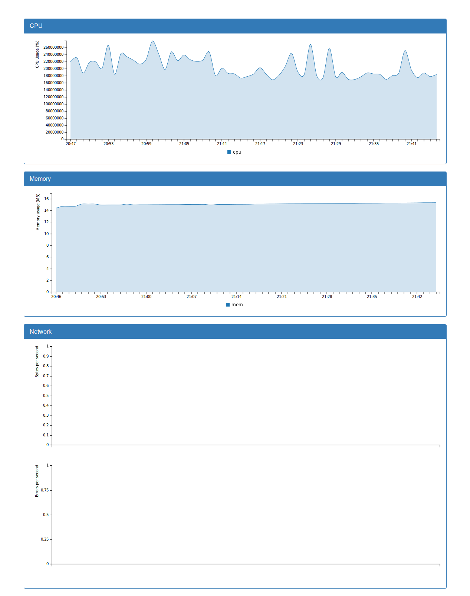

Oculus
======

A simple monitoring system for Docker. A dockerized small app (publisher) will consume periodically stats about resource usage of the running docker containers, polling the Docker API and storing the results in a redis container as a temporary storage. Flask, bootstrap and c3.js (a d3 wrapper) add some colour.

> This is obviously still a work in progress. Docker API stats will 'only work when using the libcontainer exec-driver'[\[1\]](https://docs.docker.com/reference/api/docker_remote_api_v1.18/#get-container-stats-based-on-resource-usage).



Architecture
------------

pass

Configuration
-------------

pass

Set Up The Environment
----------------------

Run **Redis** (to store stats timeseries):

```
 docker run --name redis -p 6379:6379 -d redis:3
```

Run **Publisher** (docker container with a cron that polls docker API every minute):

```
 docker run --rm -v /var/run/docker.sock:/var/run/docker.sock --link redis:db --name oculus_publisher oculus/publisher
```

Run **Oculus** web front:

> (still working in a dockerized solution)
> python run.py

Then go to http://localhost:5000/ 
